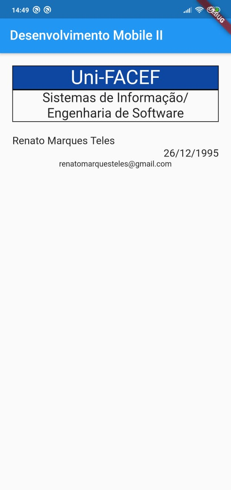

# Atividade Layout Flutter

Faça um App com Flutter em que mostre os seguintes dados, sendo um abaixo do
outro e cada um deles como um novo Widget.

1. Uni-FACEF [fundo azul, texto tamanho 30 centralizado]
2. Sistemas de Informação/Engenharia de Software [borda em volta e texto 20 centralizado]
3. Seu nome [texto 16 alinhado à esquerda]
4. Sua data de nascimento [texto 16 alinhado à direito]
5. Seu email [texto 12 centralizado]

# Resultado

